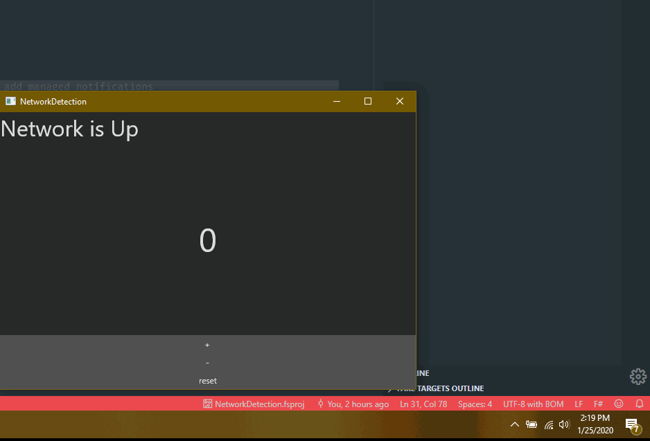

# Network Detection Sample

```
git clone 
dotnet restore
dotnet run
```

or if using VSCode press <kbd>F5</kbd>

This sample uses `System.Net.NetworkInformation` API's to detect network availability

